# aws-wp-lightsail-tf
This repo is to create the wp lightsail instance with the terraform.
Below is the architecture diagram that will be created by this terraform project.

| directory | explanation |
| ---- | ---- |
| ./.ssh/ | Put your ssh-key(this directory is not exist on default) |
| ./modules/lightsail/ | Create lightsail instance. |
| ./modules/statc_host/ | Set up the access method to lightsail to SSL terminated using Cloudfront. |

## 1. Usage
1. Manually create a Route 53 Zone on AWS.
2. Set the same domain name and lightsail parameters in variables.tf as a domain the one registered in the manually created Route53.
3. ``terraform init``
4. ``terraform plan``
5. ``terraform fmt -recursive`` and ``terraform validate``
6. ``terraform apply``
7. In case of using a domain purchased by another company, please register the name_servers information print according to outputs.tf of the static_host module to the site where you purchased the domain.

Remember to associate the CRANE of the ACM certificate with the domain.

## 2. Notes
.tfstate is managed on S3 bucket, So please create .tfstate in S3 referenced backend.tf before ru terraform commands.

This project is intended to run on AWS Cloud9.

AWS CLI or AWS credentials are registered in an environment variable on your dev machine, please adjust the code.

## 3. Recommended Things to do after building Lightsail
* Disable access to wp-configure.php
* Install some plugins in wordpress for security purposes.

## 4. Memorandum of other configurations using Lightsail
### Using S3 for storing images in wordpress

[Reference site(JP)](https://abillyz.com/moco/studies/461)

### Handle emails (contact forms, etc.) with wordpress
SES configuration required.

[Reference site(JP)](https://qiita.com/yoshiki_mbp/items/98fe88ffbba7282770c0)
[reference](https://lightsail.aws.amazon.com/ls/docs/ja_jp/articles/amazon-lightsail-enabling-email-on-wordpress)

### Monitor access to lightsail with cloudwatch
To use Cloudwatch to monitor access to lightsail, you need to create an IAM user for monitoring, install and configure the cloudwatch agent on lightsail, create a log group, etc.

[Reference site(JP)](https://linuxfun.org/2022/10/04/how-to-monitor-lightsail-by-cloudwatch/)

## 5. Environment
* AWS Cloud9
* terraform v1.5.2